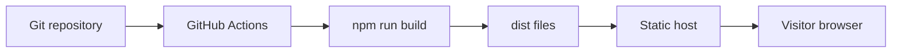

# Static Deployment

```mermaid
flowchart LR
 Repo[Git repository] --> CI[GitHub Actions]
 CI --> Build[npm run build]
 Build --> Dist[dist files]
 Dist --> Host[Static host]
 Host --> Browser[Visitor browser]
```

No application server or database is part of the current model.
