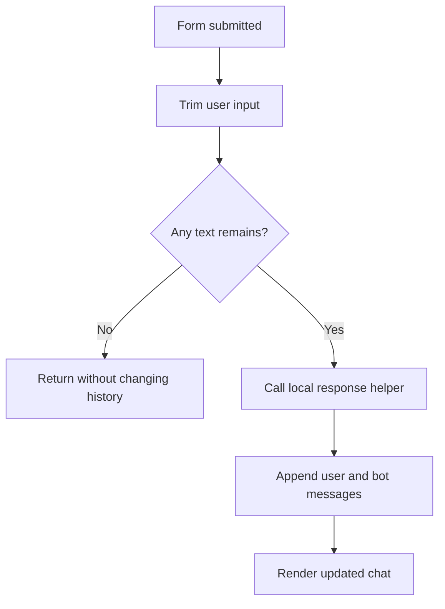

# Error and Empty Input Flow

```mermaid
flowchart TD
 A[Form submitted] --> B[Trim user input]
 B --> C{Any text remains?}
 C -- No --> D[Return without changing history]
 C -- Yes --> E[Call local response helper]
 E --> F[Append user and bot messages]
 F --> G[Render updated chat]
```

The current helper is synchronous. There is no remote provider error branch.
