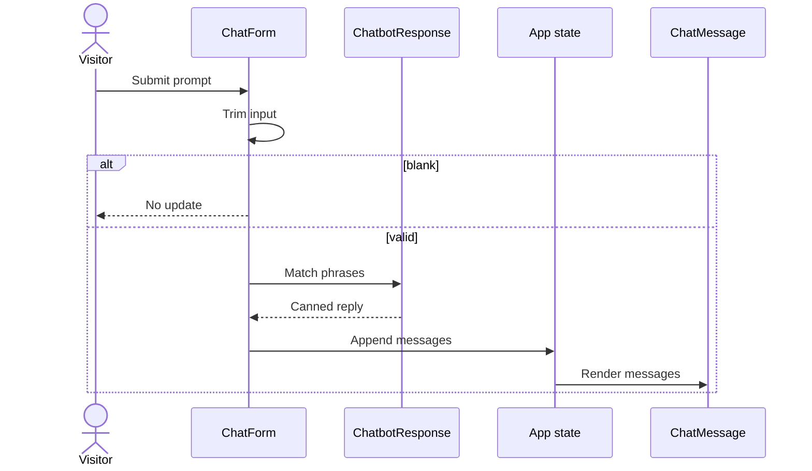

# Message Lifecycle

```mermaid
sequenceDiagram
 actor Visitor
 participant Form as ChatForm
 participant Rules as ChatbotResponse
 participant State as App state
 participant View as ChatMessage
 Visitor->>Form: Submit prompt
 Form->>Form: Trim input
 alt blank
  Form-->>Visitor: No update
 else valid
  Form->>Rules: Match phrases
  Rules-->>Form: Canned reply
  Form->>State: Append messages
  State->>View: Render messages
 end
```
