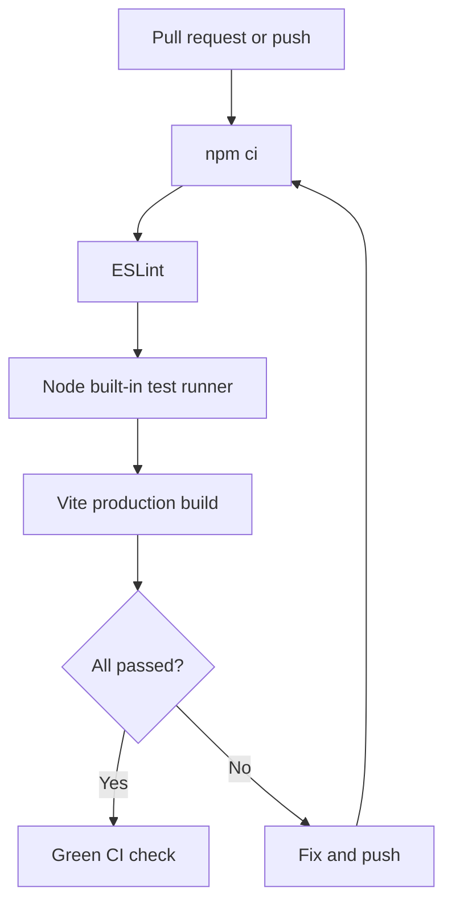

# Test and Build Pipeline

```mermaid
flowchart TD
 A[Pull request or push] --> B[npm ci]
 B --> C[ESLint]
 C --> D[Node built-in test runner]
 D --> E[Vite production build]
 E --> F{All passed?}
 F -- Yes --> G[Green CI check]
 F -- No --> H[Fix and push]
 H --> B
```

This workflow checks code quality and build output. It does not deploy the application.
