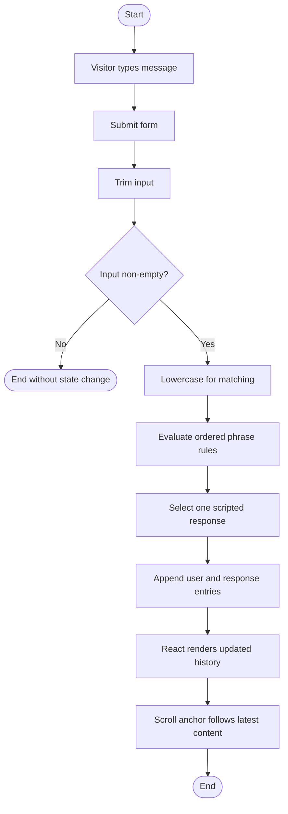

# 🔄 UML-Style Activity Diagram

```mermaid
flowchart TD
 Start([Start]) --> Type[Visitor types message]
 Type --> Submit[Submit form]
 Submit --> Trim[Trim input]
 Trim --> Valid{Input non-empty?}
 Valid -- No --> End([End without state change])
 Valid -- Yes --> Normalize[Lowercase for matching]
 Normalize --> Rules[Evaluate ordered phrase rules]
 Rules --> Reply[Select one scripted response]
 Reply --> Append[Append user and response entries]
 Append --> Render[React renders updated history]
 Render --> Scroll[Scroll anchor follows latest content]
 Scroll --> End2([End])
```

## Activity boundaries

This activity is synchronous and local to the page. There is no remote request, authentication step, API retry, or database transaction.
